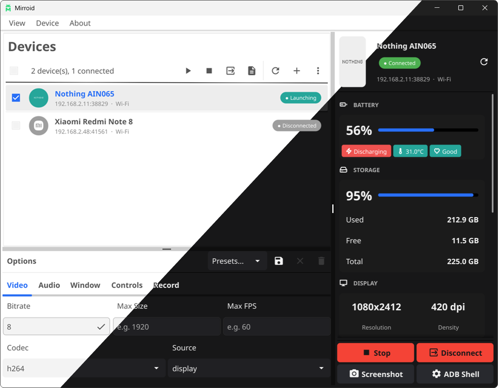

> [!WARNING]
> This project is under development. Expect frequent breaking changes until the `1.0.0` release.

<p align="center">
  
</p>

<h1 align="center">Mirroid</h1>

<p align="center">
  Yet another GUI for <a href="https://github.com/Genymobile/scrcpy">scrcpy</a>, built with Go and <a href="https://fyne.io/">Fyne</a>.
</p>

---

<br>
<p align="center">
  
</p>

## Features

- **Easy Pairing** : pair devices via USB or wireless QR code with a single click
- **Full scrcpy Options** : bitrate, max size, FPS, codec (h264/h265/av1), audio, window flags, HID input, ~~recording~~
- **Presets** : save and load option configurations as JSON
- **Multi-device** : launch scrcpy on multiple devices simultaneously
- **Cross-platform** : works on Windows, macOS, and Linux (only tested on Windows so far)
- **Single Executable** : no dependencies, no electron, just one binary to run

## Why make this?

Tired of typing out long scrcpy commands in the terminal. Wanted a simple way to manage multiple devices and configurations without memorizing flags.

## Installation

Download the latest release from [Releases](https://github.com/EverythingSuckz/Mirroid/releases) or by clicking the appropriate link below:

| Platform    | Recommended                                                                                                                                                       | Alternative                                                                                                               |
| ----------- | ----------------------------------------------------------------------------------------------------------------------------------------------------------------- | ------------------------------------------------------------------------------------------------------------------------- |
| **Windows** | [Installer](https://github.com/EverythingSuckz/Mirroid/releases/latest/download/mirroid-windows-amd64-setup.exe)                                                  | [Portable `.zip`](https://github.com/EverythingSuckz/Mirroid/releases/latest/download/mirroid-windows-amd64-portable.zip) |
| **Linux**   | [`.deb` (Debian/Ubuntu)](https://github.com/EverythingSuckz/Mirroid/releases/latest) or [`.AppImage`](https://github.com/EverythingSuckz/Mirroid/releases/latest) | [`.tar.xz`](https://github.com/EverythingSuckz/Mirroid/releases/latest)                                                   |
| **macOS**   | [`.dmg` (drag to Applications)](https://github.com/EverythingSuckz/Mirroid/releases/latest/download/mirroid-macos-arm64.dmg)                                      | [`.zip`](https://github.com/EverythingSuckz/Mirroid/releases/latest/download/mirroid-macos-arm64.zip)                     |

### macOS: Gatekeeper bypass

Mirroid releases are ad-hoc signed (no Apple Developer ID yet), so the first launch will fail with **"Mirroid is damaged and can't be opened"** or a Gatekeeper block. To allow it:

```bash
xattr -dr com.apple.quarantine /Applications/Mirroid.app
```

Or right-click the app in Finder → **Open** → **Open** to override Gatekeeper for that launch. After this, future launches work normally.

## Building

#### Debug build:

```bash
go build -o mirroid.exe .
```

#### Release build with embedded assets:

```bash
fyne package -release
```

## License

This project is licensed under the Apache License, Version 2.0. See the [LICENSE](LICENSE) file for details.
